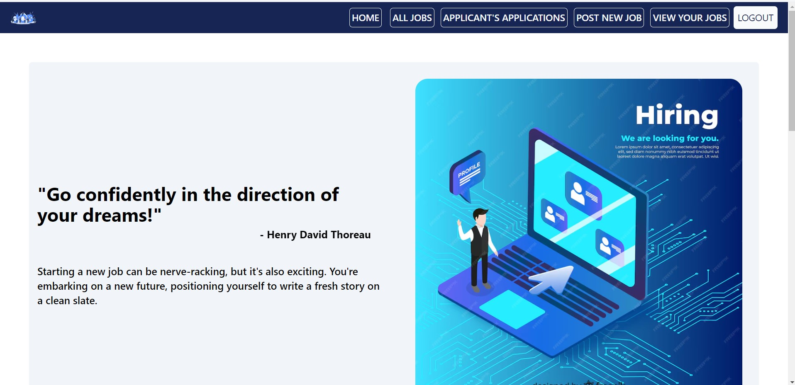

# JobG

Welcome to JobG, a full-stack MERN (MongoDB, Express, React, Node.js) application designed to streamline the job application process for both job seekers and employers.

## Overview

JobG offers distinct functionalities for job seekers and employers:

### Job Seekers:
- **Browse Job Postings:** View all new job postings.
- **Apply for Jobs:** Apply to any job that matches your profile.
- **Manage Applications:** View and delete your applications for various jobs.

### Employers:
- **Post Job Openings:** Create and manage job postings.
- **Edit/Delete Job Postings:** Update or remove job listings as needed.
- **View Applicants:** Review applicants for each job posting.
- **Job Details:** Access detailed information for all jobs posted.

## Tech Stack

JobG is built using the following technologies:

- **Frontend:**
  - 
  - 
  
- **Backend:**
  - 
  - 
  - 
  
- **Other Services:**
  - 

## Project Features

### User Authentication:
- Separate login/signup for job seekers and employers.

### Job Seekers:
- **Dashboard:** View all job postings.
- **Job Application:** Apply to jobs with a click.
- **Application Management:** View and delete applications.

### Employers:
- **Job Management:** Create, edit, and delete job postings.
- **Applicant Tracking:** View and manage applicants for each job.

## Screenshots

